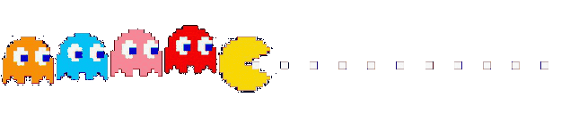

# Hi 👋, I am Pritam Halder

### "Success is not final, failure is not fatal, it is the courage to continue that counts"

### &bull; &bull; &bull;

#### I'm a Kolkata based software engineer who specializes in building and designing full stack products leading projects from research to implementation. I combine empathy, business strategy and design to create exceptional user experiences.

### &bull; &bull; &bull;

#### **[Resume](./assets/Resume%20-%20Pritam%20Halder.pdf) &bull; [CV](./assets/CV%20-%20Pritam%20Halder.pdf)**

### ✨ **[Portfolio](https://pritamh.netlify.app)** ✨

<!--  -->
<!--  -->
<!--  -->
<!--  -->
<!--  -->

<h1 align="center">🍔 What's going on, you ask ?</h1>

-   🌱 I’m currently learning **Go and its image libraries with a multi-million dollar idea 😁**.
-   👨‍💻 All of my projects are available at my **[Portfolio](https://pritamh.netlify.app)**.
-   💬 Ask me about : **Python, Go, JavaScript, TypeScript, ReactJs, NextJs, NodeJs, ExpressJs, MongoDB, Linux Customizations (Ricing) and just about life 🤗**.
-   📫 How to reach me ? **pritamhalder.portfolio@gmail.com**.
-   📄 Get to know about my professional field of work : **[My Resume](./assets/Resume%20-%20Pritam%20Halder.pdf)**.
-   📄 Get to know about my academic experiences : **[My CV](./assets/CV%20-%20Pritam%20Halder.pdf)**.

<!--  -->
<!--  -->
<!--  -->
<!--  -->
<!--  -->

### **Programming Languages**

### **Databases**

### **Frameworks**

### **Cloud Services**

### **Designing Tools**

### **Workflow**

<!--  -->
<!--  -->
<!--  -->
<!--  -->
<!--  -->

# 🌟 My Github Stats

<!--  -->
<!--  -->
<!--  -->
<!--  -->
<!--  -->

# 🤠 About Myself

### Hello ! So now that you have gone through my skills, projects and my interests, how about I tell you about my passion :) ? I am an University student, persuing Masters in Computer Science in 1st year, living with my parents and my younger brother in Kolkata.

### I love drawing, digital painting, graphics designing, reading, coding, programming, photoshoping, making illustrations, making videos, running a youtube channel and many more.

### My true goal in my life is to do the job I love, that is programming, coding & designing; because in that moment I would be at my best, always :)

### &bull; &bull; &bull;

#### **[Resume](./assets/Resume%20-%20Pritam%20Halder.pdf) &bull; [CV](./assets/CV%20-%20Pritam%20Halder.pdf)**

### ✨ **[Porfolio](https://pritamh.netlify.app)** ✨

<!--  -->
<!--  -->
<!--  -->
<!--  -->
<!--  -->

### **(｡◕‿◕｡)**

### Created with ❤ by yours sincerely.

#### &copy;Pritam Halder 2021

